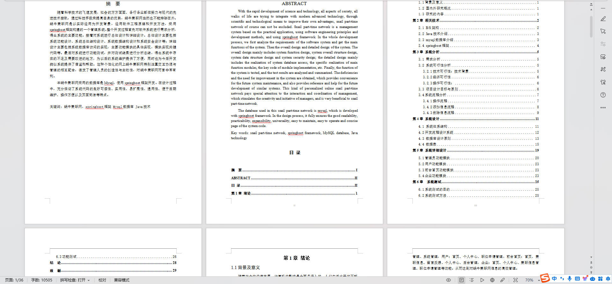

# 基于Springboot的蜗牛兼职网

## Springboot-0022


## 技术栈

Springboot mybatisplus vue mysql maven


## 数据库表(8张)


## 功能介绍

```properties
管理员
首页、个人中心、用户管理、企业管理、兼职信息管理、职位申请管理、留言板管理、系统管理，用户：首页、个人中心、职位申请管理，前台首页：首页、兼职信息、留言反馈、个人中心、后台管理，企业：首页、个人中心、兼职信息管理、职位申请管理等功能。
```


## 图片

### 前台


### 后台


## 访问路径

### 前台

```properties
http://localhost:8080/springbootc8v27/front/pages/login/login.html

账号 用户6
密码 123456
```

### 后台

```properties
http://localhost:8080/springbootc8v27/admin/dist/index.html#/login

账号 abo
密码 abo
```


## 功能图


## 文档目录




## 打赏或交流


